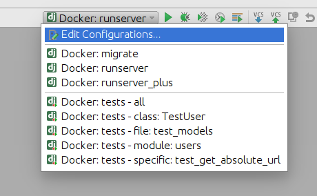

# Anvie SJC


### Setup

1. Download & Install [Docker](https://docs.docker.com/docker-for-windows/install/)

2. Setting Pycharm

- Settings docker execution

    

- Create new interpreter

    

- Select docker-compose and set configuration .local.yml

    

- Finish

    

- .idea/
    - Provided default Pycharm Run/Debug Configurations
    - In case of local modifications made by Pycharm, use update-index command for each changed file, like this:

    ```sh
    $ git update-index --assume-unchanged .idea/app.iml
    $ git update-index --skip-worktree .idea/app.iml
    ```

--------------
### Basic Commands
- Run docker-compose
    ```sh
    $ docker-compose -f local.yml up -d
    ```

- Interact container os
    ```sh
    $ docker exec -it django bash
    ```

--------------
### Code quality

1. In your host install packages following here:

    - [flake8](https://github.com/PyCQA/flake8)
    - [flake8-isort](https://github.com/gforcada/flake8-isort)
    - [black](https://github.com/ambv/black)
    - [pylint-django](https://github.com/PyCQA/pylint-django)
    - [pylint-celery](https://github.com/PyCQA/pylint-celery)
    - [pre-commit](https://github.com/pre-commit/pre-commit)

    ```sh
    $ pip install -r requirements/quality.txt
    ```

2. Install the git hook scripts

    ```sh
    $ pre-commit install
    ```

3. To ignore Flake8 check, add flag # noqa F405 in end of line

--------------
### Other

- Sentry

    - Account anhlt59@gmail.com/1234567
    - Follow this [link](https://sentry.io/organizations/fabbi-ep/issues/?project=5456409)
    to track app error
